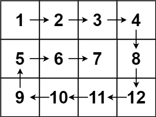

# Spiral Order Matrix

Given an `m x n` matrix, return all elements of the matrix in spiral order.

## Examples

### Example 1

**Input:**

```plaintext
matrix = [[1, 2, 3], [4, 5, 6], [7, 8, 9]]
```


**Output:**

```plaintext
[1, 2, 3, 6, 9, 8, 7, 4, 5]
```

### Example 2

**Input:**

```plaintext
matrix = [[1, 2, 3, 4], [5, 6, 7, 8], [9, 10, 11, 12]]
```



**Output:**

```plaintext
[1, 2, 3, 4, 8, 12, 11, 10, 9, 5, 6, 7]
```

## Constraints

- `m == matrix.length`
- `n == matrix[i].length`
- `1 <= m, n <= 10`
- `-100 <= matrix[i][j] <= 100`